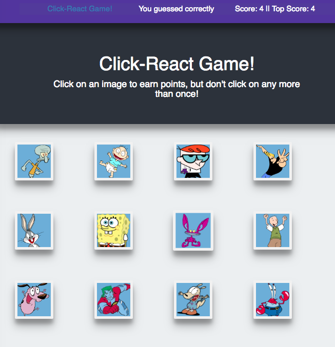

## Click-React-Game! 
Check out [my demo](http://click-react-game.herokuapp.com/)!

## Overview

For this assignment, I created a memory game with React. This assignment requires React UI components, managing component state, and responding to user events.

### Instructions

1. Check out [my demo](http://click-react-game.herokuapp.com/) to study the app's basic functionality. This demo is deployed on Heroku! I used [Create React App](https://github.com/facebookincubator/create-react-app) to start this project.

2. The application should keep track of the user's score. The user's score should be incremented when clicking an image for the first time. The user's score should be reset to 0 if they click the same image more than once.

3. Every time an image is clicked, the images rendered to the page should shuffle themselves in a random order.

4. Once the user's score is reset after an incorrect guess, the game should restart.

## Copyright
Coding Boot Camp (C) 2016. All Rights Reserved.
